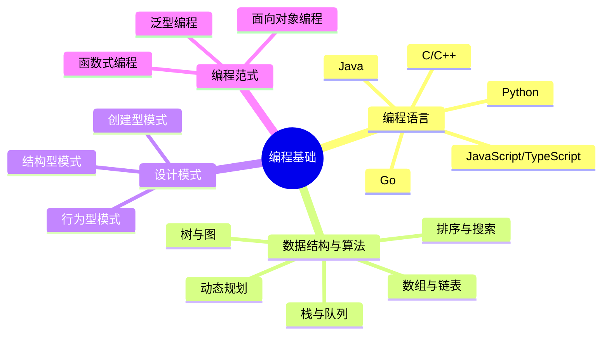

# 01 - 编程基础

## 概览

编程基础是软件工程的根基，涵盖编程语言、数据结构与算法、设计模式、编程范式等核心内容。

## 知识脑图

## 目录

| 子领域 | 说明 |
|--------|------|
| [编程语言](./编程语言/) | 各语言的核心特性与最佳实践 |
| [数据结构与算法](./数据结构与算法/) | 基础数据结构与常用算法 |
| [设计模式](./设计模式/) | 23种经典设计模式 |
| [编程范式](./编程范式/) | OOP、FP、GP 等编程范式 |
