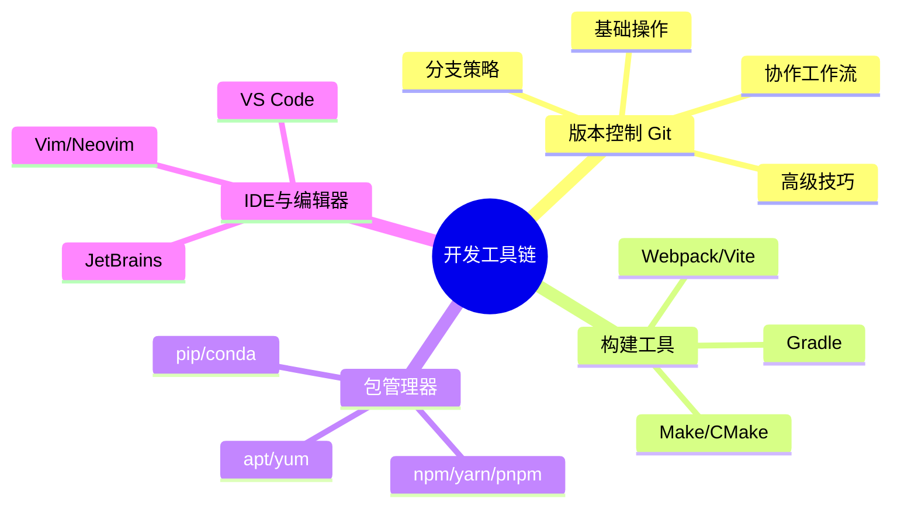

# 02 - 开发工具链

## 概览

高效的开发离不开工具链的支撑，包括版本控制、构建系统、包管理器和开发环境配置。

## 知识脑图

```mermaid
mindmap
  root((开发工具链))
    版本控制 Git
      基础操作
      分支策略
      协作工作流
      高级技巧
    构建工具
      Make/CMake
      Gradle
      Webpack/Vite
    包管理器
      npm/yarn/pnpm
      pip/conda
      apt/yum
    IDE与编辑器
      VS Code
      JetBrains
      Vim/Neovim
```

## 目录

| 子领域 | 说明 |
|--------|------|
| [Git](./Git/) | 版本控制核心知识 |
| [构建工具](./构建工具/) | 各类构建系统 |
| [包管理器](./包管理器/) | 依赖管理工具 |
