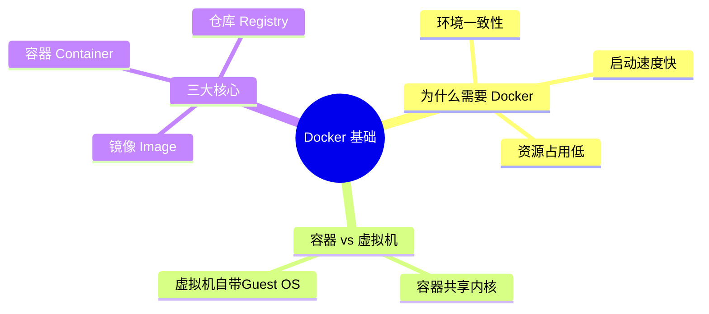

# 01 - Docker 基础概念

## 概述

Docker 是一种轻量级的“操作系统层虚拟化”技术。它解决了“在我的机器上能跑，但在你的机器上跑不起来”的经典痛点，实现了应用运行环境的一致性交付。

## 核心概念

- 镜像 (Image)：一个只读的模板，包含了运行应用所需的所有代码、库、环境变量和配置文件。可以看作是“安装包”。
- 容器 (Container)：镜像的运行实例。它带有独立的文件系统、网络配置和进程空间，可以被启动、停止、删除。
- 仓库 (Repository)：集中存放镜像文件的地方（如 Docker Hub）。

## 知识脑图



## 详细内容

### 容器与虚拟机的区别

传统虚拟机 (VM) 技术是虚拟出一套硬件后，在其上运行一个完整的操作系统 (Guest OS)，最后在这个系统上运行应用。
相比之下，Docker 容器内的应用进程直接运行于宿主机的内核，容器内没有自己的内核，也没有进行硬件虚拟。因此容器要比传统虚拟机更为轻便、启动更快。

### 镜像与容器的关系

可以类比面向对象编程：镜像是“类 (Class)”，而容器是“对象 (Object/Instance)”。
我们可以从一个镜像创建出成百上千个相互隔离的容器实例。

## 实践示例

**运行你的第一个容器 (Hello World)**

```bash
# 从 Docker Hub 拉取拉取 hello-world 镜像并运行
docker run hello-world
```

常用基础命令：

```bash
docker images          # 查看本地所有镜像
docker ps              # 查看运行中的容器
docker ps -a           # 查看所有容器（包括已停止的）
docker stop <id>       # 停止一个运行中的容器
docker rm <id>         # 删除一个容器
docker rmi <id>        # 删除一个镜像
```

## 常见问题

**Q: Docker 是跨平台的吗？**
A: Docker 容器本质上是 Linux 进程，共享 Linux 内核。Windows 和 macOS 上的 Docker 实际上是运行在一个隐藏的轻量级 Linux 虚拟机中。因此可以在三大桌面上开发，但生产环境通常都是 Linux 服务器。

## 参考资料

- [Docker 官方文档](https://docs.docker.com/)

## 关联知识

> 与本知识点有交叉关系的其他主题，添加后请同步更新 [全局知识关联图](../../../KNOWLEDGE_GRAPH.md)

- [Linux 进程与文件系统](../../03-系统与运维/Linux/README.md)
