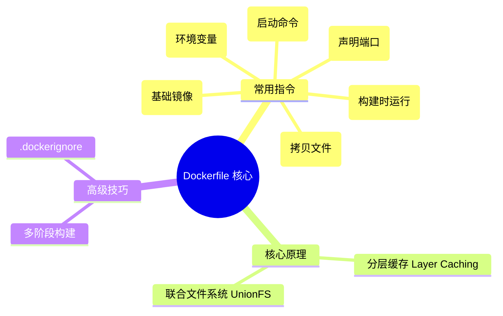

# 02 - Dockerfile 编写指南

## 概述

Dockerfile 是一个包含了用于组合镜像的命令的文本文档。Docker 通过读取 Dockerfile 中的指令自动生成镜像。掌握 Dockerfile 是将你的自己研发的项目容器化的必经之路。

## 核心概念

- 基础镜像 (Base Image)：一切自定义镜像的起点（由 `FROM` 指令指定）。
- 层 (Layer)：Dockerfile 中的大部分指令（如 `RUN`, `COPY`）都会在原镜像上面增加新的一层。
- 多阶段构建 (Multi-stage Build)：允许在一个 Dockerfile 中使用多个 `FROM` 语句，最终只保留运行所需产物，极大地减小了线上镜像体积。

## 知识脑图



## 详细内容

### 常用构建指令的区别

- `RUN` vs `CMD` vs `ENTRYPOINT`
  - `RUN`：在**构建镜像**阶段执行命令（如 `npm install` 或 `apt-get install`）。
  - `CMD`：在**容器启动**时默认执行的命令，可以被 `docker run` 后面的参数覆盖。
  - `ENTRYPOINT`：也是容器启动时执行的命令，但通常**不易被覆盖**，常用于把容器作为可执行程序使用。

- `COPY` vs `ADD`
  - `COPY`：仅仅是拷贝本地文件到镜像中（推荐，更纯粹）。
  - `ADD`：也是拷贝，但附带了解压 tar 文件以及从 URL 获取文件的功能（官方建议优先使用COPY）。

### 镜像分层与缓存优化

Docker 构建镜像是分层进行的，每一条指令都是一层。如果 Dockerfile 前面的指令没变，Docker 会直接使用缓存。因此，最佳实践是：
**频繁变动的文件（如源代码）的 COPY 应该放在 Dockerfile 的末尾，而不常变动的文件（如包管理配置、依赖安装）提前。**

## 实践示例

**一个典型的 Node.js 项目多阶段构建 Dockerfile：**

```dockerfile
# 阶段 1: 编译构建
FROM node:18-alpine AS builder
WORKDIR /app
# 先复制依赖配置文件，利用缓存
COPY package.json package-lock.json ./
RUN npm ci
# 复制全部源码并构建
COPY . .
RUN npm run build

# 阶段 2: 生产运行环境
FROM node:18-alpine AS runner
WORKDIR /app
# 仅仅把构建阶段（builder）产出的有用文件复制过来
COPY --from=builder /app/dist ./dist
COPY --from=builder /app/node_modules ./node_modules
COPY --from=builder /app/package.json ./package.json

EXPOSE 3000
CMD ["npm", "start"]
```

## 常见问题

**Q: 容器里的时区不对怎么办？**
A: 可以在 Dockerfile 中配置环境变量和时区数据包：

```dockerfile
ENV TZ=Asia/Shanghai
RUN ln -snf /usr/share/zoneinfo/$TZ /etc/localtime && echo $TZ > /etc/timezone
```

## 参考资料

- [Dockerfile Best Practices](https://docs.docker.com/develop/develop-images/dockerfile_best-practices/)

## 关联知识

> 与本知识点有交叉关系的其他主题，添加后请同步更新 [全局知识关联图](../../../KNOWLEDGE_GRAPH.md)

- [Node.js 包管理工具](../../02-开发工具链/包管理器/README.md)
