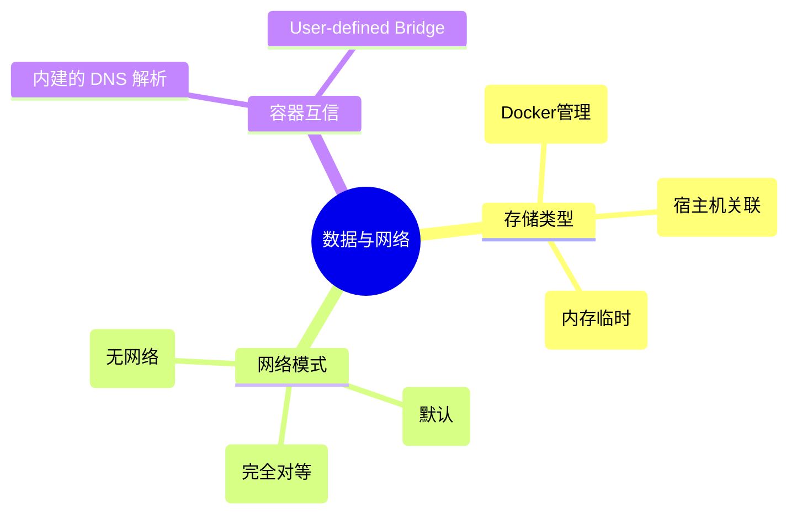

# 03 - Docker 数据卷与网络

## 概述

容器是“无状态的”（Stateless）且隔离的。如果不做处理，容器重启或删除后其内部产生的数据就会丢失；同时容器彼此间在网络上默认是相互独立的。本阶段解决数据的持久化和容器互联两大课题。

## 核心概念

- 数据持久化：
  - 数据卷 (Volumes)：Docker 完全管理的宿主机目录，推荐的数据持久化方案。
  - 绑定挂载 (Bind Mounts)：直接将宿主机的绝对路径映射到容器中，适合在开发时共享源代码。
- 网络模式：
  - Bridge：默认模式，Docker 在宿主机虚拟一个网桥，容器连接其上并分配内网 IP。
  - Host：容器直接跳过网络隔离，使用宿主机的网络栈（适合高性能网络需求）。
  - None：完全没有网络。

## 知识脑图



## 详细内容

### 为什么推荐 Volumes 而不是 Bind Mounts？

Volumes 存在于宿主机 Docker 特定的存储目录（如 Linux 的 `/var/lib/docker/volumes/`），完全由 Docker 守护进程管理。这样可以：

1. 完全屏蔽宿主机文件系统目录结构的差异，更易于迁移。
2. 可以在多个容器之间安全地共享使用。
3. 性能通常优于对 Mac 和 Windows 上的 Bind Mounts 操作。

### 自定义 Bridge 网络 (User-Defined Bridge)

在使用默认的 `bridge` 网络时，容器之间只能通过 IP 互访，极其不便（因为 IP 会变）。
当我们通过 `docker network create my-net` 创建自定义网络后，把容器加入到这个网络，容器之间就能**直接使用容器名（Container Name）作为域名相互 Ping 通**了（Docker 内置了 DNS 服务器解析）。

## 实践示例

**启动一个带持久化存储 MySQL 并在自定义网络中：**

```bash
# 1. 创建网络
docker network create my-app-net

# 2. 创建数据卷
docker volume create mysql_data

# 3. 运行 MySQL，指定网络、关联数据卷，注入环境变量
docker run -d \
  --name my-mysql \
  --network my-app-net \
  -v mysql_data:/var/lib/mysql \
  -e MYSQL_ROOT_PASSWORD=secret \
  mysql:8.0
```

## 常见问题

**Q: 我想在开发时修改代码立刻生效，应该怎么挂载容器？**
A: 使用 Bind Mount。在终端可以这样执行：
`docker run -v $(pwd):/app -w /app node:18 npm run dev`
它会把你当前的物理机目录映射进容器内的 `/app` 目录。你物理机改了代码，容器内立刻感知并触发热重载。

## 参考资料

- [Docker Storage](https://docs.docker.com/storage/)
- [Docker Networking](https://docs.docker.com/network/)

## 关联知识

> 与本知识点有交叉关系的其他主题，添加后请同步更新 [全局知识关联图](../../../KNOWLEDGE_GRAPH.md)

- [计算机网络之桥接原理](../../04-网络与安全/计算机网络/README.md)
- [关系型数据库 MySQL](../../05-数据管理/数据库/MySQL.md)
