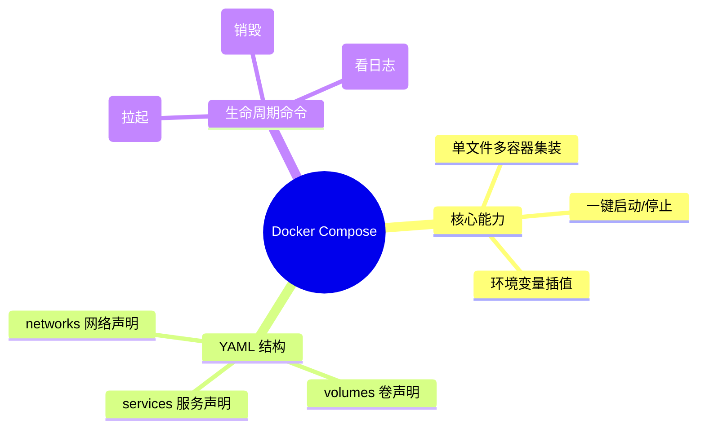

# 04 - Docker Compose 实战

## 概述

现代化的应用往往不仅是一个服务，通常是前端、后端 API 再加上数据库和缓存。单独通过 `docker run` 命令一个一个启动不仅繁琐，而且容易遗漏网络、卷等配置。Docker Compose 就是用来定义和运行复杂的多容器应用的工具。

## 核心概念

- `docker-compose.yml`：基于 YAML 格式的配置文件，声明了你需要启动哪些“服务 (services)”，以及它们依赖哪些网络和卷。
- Service：一个应用集合中的某个组件（例如：运行 PostgreSQL 的容器）。
- Project：由 Compose 管理的整个生态系统（默认项目名是你当前所在目录的名字）。

## 知识脑图



## 详细内容

### 服务编排的依赖控制

虽然 Compose 启动容器的速度很快，且大多数情况下几乎是同时启动，但我们往往希望有启动顺序（比如，数据库启动好之后，再去启动后端 API）。
在 `docker-compose.yml` 中，使用 `depends_on` 关键字可以控制**容器启动的先后顺序**。但这本身并不能保证服务里的软件就绪，有时需要配合健康检查 (Healthcheck)。

### 一键部署全家桶

配置好后，只需一条命令：
`docker-compose up -d`
即可在后台拉起所有服务；同样只需：
`docker-compose down`
即可将服务、自动创建的默认网络全部彻底清理。极大简化了我们在本地开发或简单服务器上的部署心智负担。

## 实践示例

**典型的 Django + PostgreSQL 编排：**

```yaml
version: "3.9"

services:
  db:
    image: postgres:15
    volumes:
      - postgres_data:/var/lib/postgresql/data
    environment:
      - POSTGRES_DB=mydb
      - POSTGRES_USER=myuser
      - POSTGRES_PASSWORD=mypassword

  web:
    build: .
    command: python manage.py runserver 0.0.0.0:8000
    volumes:
      - .:/code
    ports:
      - "8000:8000"
    depends_on:
      - db

volumes:
  postgres_data:
```

_当你在这个目录下运行 `docker-compose up` 即可启动所有的栈。_

## 常见问题

**Q: `docker-compose.yml` 里面还需要写 `network` 吗？**
A: 不需要手动指定网络，Compose 会自动为这几个服务创建一个属于该“Project”的默认桥接网络。比如在一个叫 `my_app` 的文件夹里启动，它会自动建一个叫 `my_app_default` 的网络并把所有服务加进去。

## 参考资料

- [Docker Compose 官方文档](https://docs.docker.com/compose/)

## 关联知识

> 与本知识点有交叉关系的其他主题，添加后请同步更新 [全局知识关联图](../../../KNOWLEDGE_GRAPH.md)

- [YAML 文件基本格式](../../01-编程基础/编程语言/README.md)
- [微服务架构探索](../../06-架构与设计/微服务/README.md)
