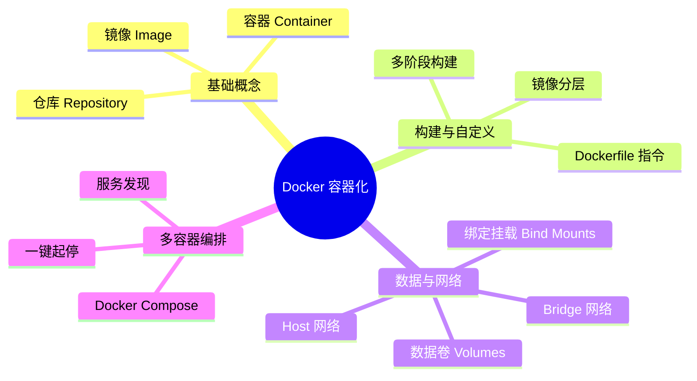

# Docker 容器化

## 概览

Docker 是一个开源的应用容器引擎，让开发者可以打包他们的应用以及依赖包到一个可移植的镜像中，然后发布到任何流行的 Linux 或 Windows 机器上，也可以实现虚拟化。容器是完全使用沙箱机制，相互之间不会有任何接口。

## 知识脑图

## 学习路线与目录

按照以下分为 4 个阶段循序渐进地学习 Docker 技术栈：

| 阶段   | 笔记链接                                            | 核心目标                                                                   |
| ------ | --------------------------------------------------- | -------------------------------------------------------------------------- |
| 阶段一 | [01-Docker基础概念](./01-Docker基础概念.md)         | 理解容器与虚拟机差异，掌握镜像、容器、仓库三大核心概念                     |
| 阶段二 | [02-Dockerfile编写指南](./02-Dockerfile编写指南.md) | 学会编写 Dockerfile，掌握底层分层原理和多阶段构建，将应用打包成镜像        |
| 阶段三 | [03-Docker数据卷与网络](./03-Docker数据卷与网络.md) | 掌握持久化保存容器内部数据的方法，以及容器间通信的网络模式                 |
| 阶段四 | [04-Docker-Compose实战](./04-Docker-Compose实战.md) | 应对真实项目，编写 `docker-compose.yml` 统筹管理 Web、数据库、缓存等多服务 |
