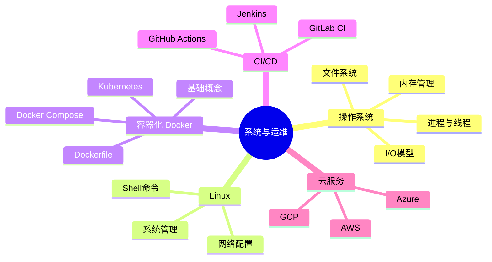

# 03 - 系统与运维

## 概览

理解操作系统、容器化技术和持续集成/部署是现代软件开发者的必备技能。

## 知识脑图

## 目录

| 子领域              | 说明                                |
| ------------------- | ----------------------------------- |
| [Linux](./Linux/)   | Linux 系统管理与操作                |
| [Docker](./Docker/) | 容器化技术（已开启 4 阶段学习记录） |
| [CI-CD](./CI-CD/)   | 持续集成与持续部署                  |
