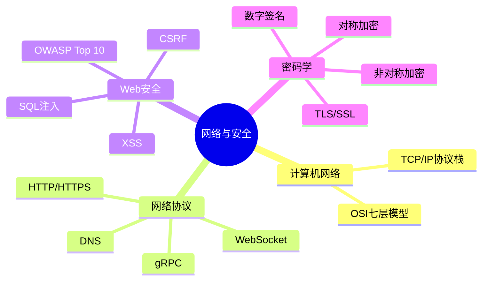

# 04 - 网络与安全

## 概览

计算机网络是分布式系统的基础，网络安全则是保障系统可靠运行的关键。

## 知识脑图

```mermaid
mindmap
  root((网络与安全))
    计算机网络
      OSI七层模型
      TCP/IP协议栈
    网络协议
      HTTP/HTTPS
      DNS
      WebSocket
      gRPC
    Web安全
      XSS
      CSRF
      SQL注入
      OWASP Top 10
    密码学
      对称加密
      非对称加密
      数字签名
      TLS/SSL
```

## 目录

| 子领域 | 说明 |
|--------|------|
| [计算机网络](./计算机网络/) | 网络基础与协议栈 |
| [Web安全](./Web安全/) | Web 应用安全防护 |
