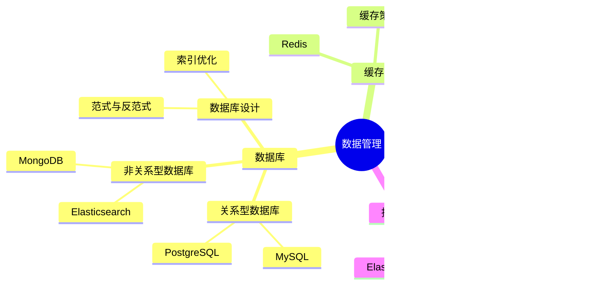

# 05 - 数据管理

## 概览

数据是应用的核心，掌握数据库、缓存、消息队列等技术是构建高性能系统的基础。

## 知识脑图

```mermaid
mindmap
  root((数据管理))
    数据库
      关系型数据库
        MySQL
        PostgreSQL
      非关系型数据库
        MongoDB
        Elasticsearch
      数据库设计
        范式与反范式
        索引优化
    缓存
      Redis
      Memcached
      缓存策略
    消息队列
      Kafka
      RabbitMQ
      消息模型
    搜索引擎
      Elasticsearch
      全文检索原理
```

## 目录

| 子领域 | 说明 |
|--------|------|
| [数据库](./数据库/) | 关系型与非关系型数据库 |
| [消息队列](./消息队列/) | 异步消息通信 |
