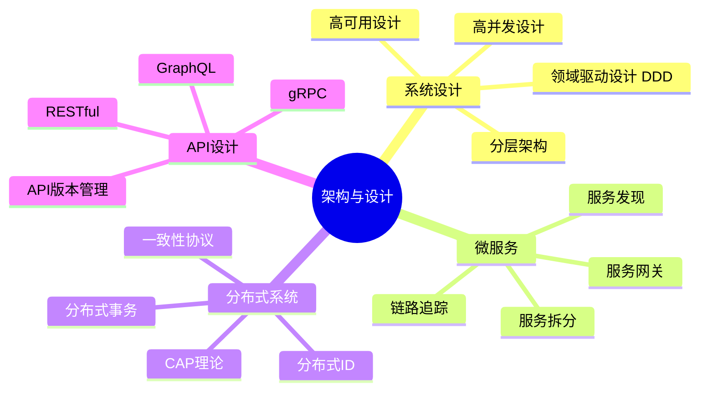

# 06 - 架构与设计

## 概览

软件架构决定了系统的可扩展性、可维护性和性能表现。

## 知识脑图

```mermaid
mindmap
  root((架构与设计))
    系统设计
      高可用设计
      高并发设计
      分层架构
      领域驱动设计 DDD
    微服务
      服务拆分
      服务发现
      服务网关
      链路追踪
    分布式系统
      CAP理论
      一致性协议
      分布式事务
      分布式ID
    API设计
      RESTful
      GraphQL
      gRPC
      API版本管理
```

## 目录

| 子领域 | 说明 |
|--------|------|
| [系统设计](./系统设计/) | 系统架构与设计方法论 |
| [微服务](./微服务/) | 微服务架构模式 |
| [API设计](./API设计/) | API 设计最佳实践 |
