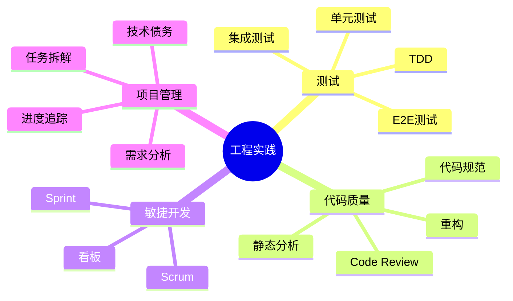

# 07 - 工程实践

## 概览

工程实践关注如何高效、高质量地交付软件，是将个人编码能力提升为团队工程能力的关键。

## 知识脑图

```mermaid
mindmap
  root((工程实践))
    测试
      单元测试
      集成测试
      E2E测试
      TDD
    代码质量
      代码规范
      Code Review
      静态分析
      重构
    敏捷开发
      Scrum
      看板
      Sprint
    项目管理
      需求分析
      任务拆解
      进度追踪
      技术债务
```

## 目录

| 子领域 | 说明 |
|--------|------|
| [测试](./测试/) | 软件测试方法与工具 |
| [代码质量](./代码质量/) | 代码质量管理 |
| [项目管理](./项目管理/) | 项目管理方法论 |
