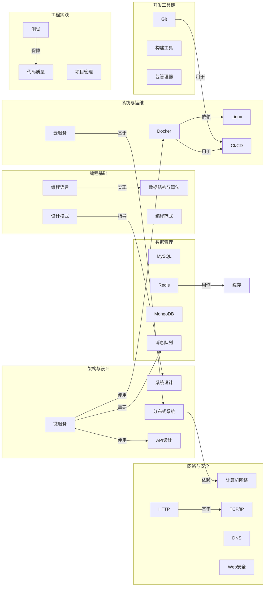

# 🗺️ 全局知识关联图

> 本图汇总所有笔记中的"关联知识"，展示知识间的交叉与依赖关系。
> 每次新增或更新笔记的"关联知识"时，请同步更新此图。

## 知识关联全景

## 如何更新

1. 在笔记的**"关联知识"**部分添加新的关联
2. 回到本文件，在 `%% === 知识关联 ===` 下方添加新的连线
3. 格式：`A -->|关系描述| B`
4. 提交时在 commit message 中注明更新了关联图
