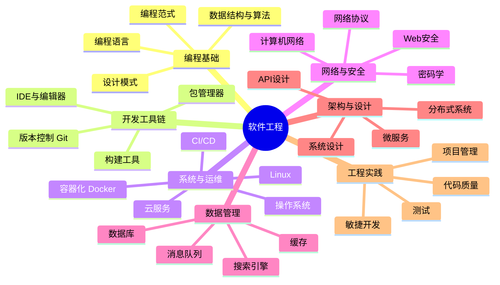

# 🧠 软件工程知识体系

> 个人软件工程知识库 — 使用 Markdown + Mermaid 脑图构建

## 总览脑图

## 📂 目录导航

| 编号 | 领域 | 说明 |
|------|------|------|
| [01-编程基础](./01-编程基础/) | 编程语言、数据结构与算法、设计模式、编程范式 | 编程的核心基础知识 |
| [02-开发工具链](./02-开发工具链/) | Git、构建工具、包管理器、IDE | 日常开发必备工具 |
| [03-系统与运维](./03-系统与运维/) | Linux、Docker、CI/CD、云服务 | 系统运维与部署 |
| [04-网络与安全](./04-网络与安全/) | 计算机网络、网络协议、Web安全、密码学 | 网络基础与安全防护 |
| [05-数据管理](./05-数据管理/) | 数据库、缓存、消息队列、搜索引擎 | 数据存储与处理 |
| [06-架构与设计](./06-架构与设计/) | 系统设计、微服务、分布式系统、API设计 | 软件架构方法论 |
| [07-工程实践](./07-工程实践/) | 测试、代码质量、敏捷开发、项目管理 | 工程化最佳实践 |

## 🔗 快速链接

- [📝 笔记模板](./TEMPLATE.md) — 写新笔记时复制此模板
- [🗺️ 全局知识关联图](./KNOWLEDGE_GRAPH.md) — 知识交叉关系全景
- [🛤️ 学习路线图](./ROADMAP.md) — 学习规划与进度
