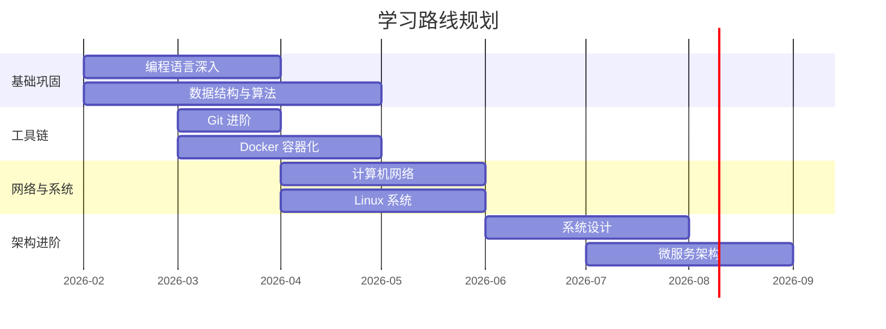

# 🛤️ 学习路线图

## 当前阶段

> 🚧 知识库初始搭建中

## 学习计划

> 以上计划仅为示例，请根据实际情况调整。

## 学习进度

| 领域          | 状态      | 笔记数 | 最近更新      |
| ------------- | --------- | ------ | ------------- |
| 01-编程基础   | 🟡 进行中 | 0      | -             |
| 02-开发工具链 | ⚪ 未开始 | 0      | -             |
| 03-系统与运维 | 🟡 进行中 | 4      | Docker 容器化 |
| 04-网络与安全 | ⚪ 未开始 | 0      | -             |
| 05-数据管理   | ⚪ 未开始 | 0      | -             |
| 06-架构与设计 | ⚪ 未开始 | 0      | -             |
| 07-工程实践   | ⚪ 未开始 | 0      | -             |
